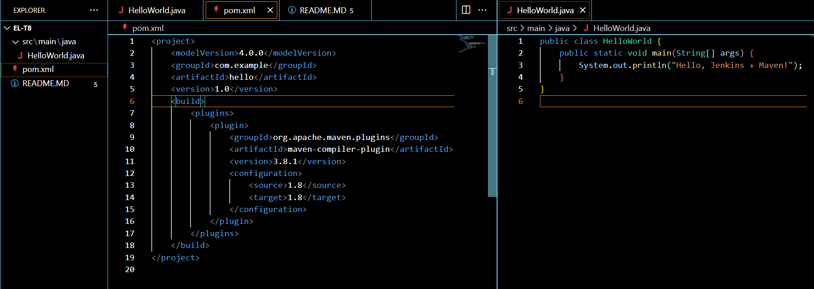

EL-t8: Jenkins Maven Build of Java HelloWorld Application

# Project Overview

This project contains a simple Java HelloWorld application built using Maven. The goal was to configure a Jenkins Freestyle job to automatically build the Java project using Maven as part of a Continuous Integration (CI) process.

The purpose of this exercise was to learn how Jenkins integrates with Maven to compile Java code, understand the structure of Jenkins jobs, and practice setting up build pipelines with source code hosted on GitHub.

## Steps I Followed

### Java Application Development

I created a simple Java program with one class named HelloWorld.java. This program contains a main method that prints the message "Hello, Jenkins + Maven!" to the console.

### Maven Project Configuration

I added a pom.xml file that configures the Maven build for the project. It defines the project metadata, specifies Java 1.8 as the source and target compatibility, and includes the Maven compiler plugin to build the project.

### GitHub Repository

I initialized a Git repository locally in the project folder EL-t8, added the source code and the Maven configuration file, and pushed it to a public GitHub repository at https://github.com/Harshil-k4/EL-t8.git for easy access by Jenkins.

### Jenkins Configuration

I launched Jenkins, which was already installed on my machine.

Under Jenkins global tools configuration, I added Maven (version 3.8.6) and ensured it is set to install automatically.

I created a new Freestyle project in Jenkins named EL-t8.

I configured the project to use Git as the source code management tool and provided the GitHub repository URL.

In the build step, I configured Jenkins to invoke Maven with the goals clean package, which cleans any previous builds and compiles/package the application.

### Triggering the Build

I manually triggered the build in Jenkins by clicking ‘Build Now’ for the EL-t8 job.

### Verification and Output

Jenkins successfully checked out the code from GitHub, executed the Maven build commands, and produced a successful build output indicating the project compiled and packaged without errors.

### Output screen shots for reference:

 
 
 

# Conclusion
This task helped me understand the integration between Jenkins and Maven, and provided practical experience setting up a CI pipeline that builds a Java application from source code stored in a GitHub repository. It clarified how Jenkins jobs can be configured to manage build tools and interact with external repositories.